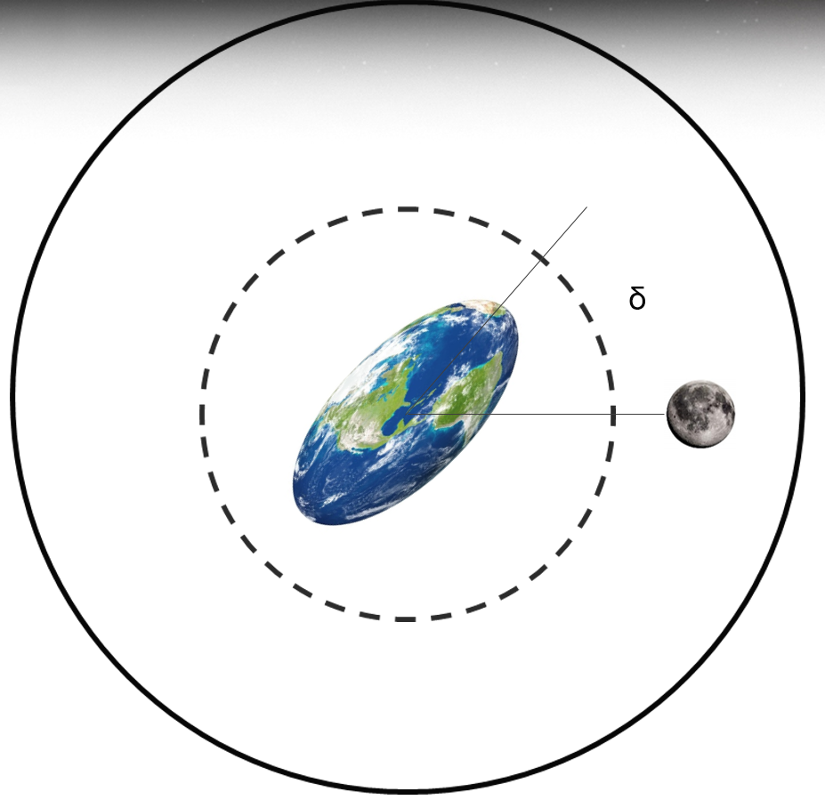

The gravitational force that pulls on a planet by a moon and star causes tides to form on the planet, like the high and low tides we see on Earth. However, it takes some time for these tides to appear, based on the structure and rigidity of the planet. This causes the tides of the planet to lead ahead of or lag behind the pulling force of the moon and star. In the image below, the tidal bulge is leading the moon.

In this case, the moon pulls on the bulge of the planet and slows it down (the planet is rotating counterclockwise here). By the same token, the bulge of the planet tugs on the moon and pulls it ahead of its original orbit, essentially pushing the moon further away. This is analgous to what is [currently happening to our Moon around Earth](https://www.astronomy.com/magazine/ask-astro/2022/08/ask-astro-how-quickly-is-the-moon-moving-away-from-earth): the moon is being pushed away at a rate of about 4cm per year and the Earth's rotation is slowing (a day is getting longer!).
