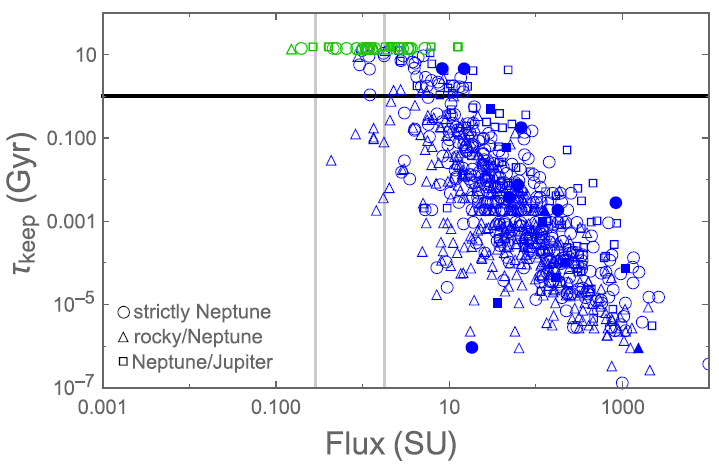

The gravitational force that pulls on a planet by a moon and star causes tides to form on the planet, like the high and low tides we see on Earth. However, it takes some time for these tides to appear, based on the structure and rigidity of the planet. This causes the tides of the planet to lead ahead of or lag behind the pulling force of the moon and star. In this image, the tidal bulge is leading the moon.

In this case, the moon pulls on the bulge of the planet and slows it down (the planet is rotating counterclockwise here). By the same token, the bulge of the planet tugs on the moon and pulls it ahead of its original orbit, essentially pushing the moon further away. This is analgous to what is [currently happening to our Moon around Earth](https://www.astronomy.com/magazine/ask-astro/2022/08/ask-astro-how-quickly-is-the-moon-moving-away-from-earth): the moon is being pushed away at a rate of about 4cm per year and the Earth's rotation is slowing (a day is getting longer!).

A moon is not safe just anywhere around a planet. If it gets too close, it will be subject to tidal dissipation which can rip it apart. If it moves too far away, it will leave its orbit around the planet. In order to simulate what will happen in the Earth-Moon-Sun system, we use parameterized tidal lag models where we assume a constant dissipation rate for the planet, which is typically high for rocky Earth-like planets and low for gaseous planets. The plot above shows the moon's separation from Earth over time: the moon starts off being pushed away but becomes tidally locked to the Earth after a certain amount of time. At this point, the sun's effect dominates and causes the Earth to spin faster and the moon to fall back in. Eventually, the moon falls in too close to the Earth and is torn apart by tidal forces. Luckily, this event is billions of years away.

We applied this method to over 2,000 Kepler exoplanets to see which ones are capable of hosting a stable moon. Because a moon can be important for habitability (by stabilizing planet tilt, driving tectonic activity, or even hosting life themselves), we are especially interested in those planetary systems that are in the habitable zone and can host a moon over 1 billion years. Here is one of our main results: a plot showing the moon retention times of rocky exoplanets, where the y-axis is time and the x-axis marks how much stellar flux the planet receives. The color indicates the ultimate fate of the moon, blue for tidally dissipated and green for stable over 15 billion years. The points in the rectangular area in the upper part of the plot are the planets that are most interesting. 

Overall, we find 36 specific planets that are potentially habitable and can hold a stable moon for a significant period of time. Take a look at [our paper](https://iopscience.iop.org/article/10.3847/1538-3881/abb29e) for the full list and for more details!

