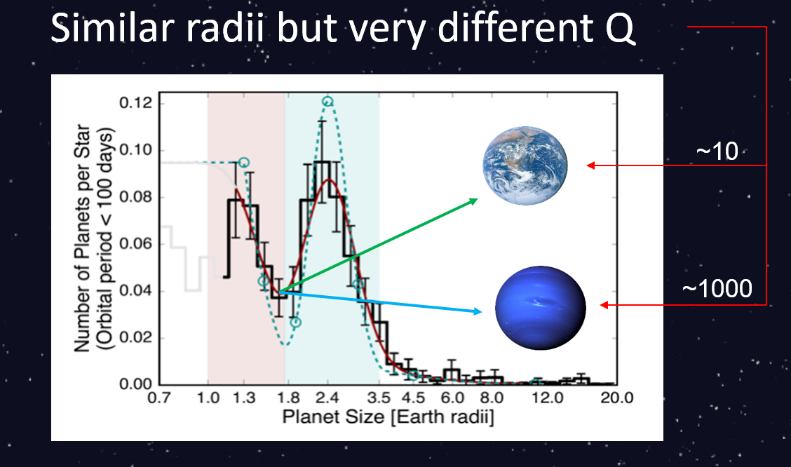

Over 5,000 planets have been discovered so far, yet there are no confirmed exomoons. However, there are two exomoon candidates: [Kepler-1625 b-i](https://www.science.org/doi/10.1126/sciadv.aav1784) and [Kepler-1708 b-i](https://www.nature.com/articles/s41550-021-01539-1), both of which are giant Neptune-sized moons orbiting a Jupiter-like planet.

In our [previous study](../project1/) on tidal interactions between an exoplanet and exomoon, we assumed a dissipation factor for each planet and integrated the sysstem forward in time to obtain a timescale. In this project we reverse the problem and show that by assuming a migration timescale, an exomoon can place constraints on its host planet's dissipation rate, and thus its likely composition. The dissipation factor is given by Q, sometimes called the quality factor. This constant is a low number, like 10, for rocky Earth-like planets and a high number, like 10^5, for gaseous giants like Jupiter. Since this value can vary over orders of magnitude, even a simple estimate of a planet's Q gives strong indication for its probable structure.

Given the positions of the exomoon candidates, we estimate what the Q of the host planets would have to be for the moon to migrate to this current location for varying migration timescales. This plot shows the result for Kepler-1708 b. The initial location of the exomoon, represented by the x-axis, does not significantly affect the Q estimation as can be seen by the relative flatness of the black curves across the plot. Thus, regardless of where the moon first formed, we only need to assume a migration timescale to get an approximation for Q. The pink region marks the estimated age of the system and is a good assumption for migration time, and this leads to a Q value of around 10^5, placing Kepler-1708 b in the category of a Jupiter-like planet. This is consistent with observations of its size!

Of course, based on the radius of the planet alone, we can already tell that Kepler-1708 b is probably a gas giant. However, this is not so clear for planets with radii between 1.5 and 2 Earth radii. These planets fall in the valley between the category of super-Earths and sub-Neptunes, described as the radius gap in [Fulton et al. 2017](https://iopscience.iop.org/article/10.3847/1538-3881/aa80eb), so based on just radius its hard to tell whether a planet in the gap is rocky like Earth or gaseous like Neptune. However, though their radii are similar, these types of planets would have very different Q values. So, if an exomoon is detected around one of these planets, we can use our method to get a pretty good estimate for its likely composition.

This picture gets complicated somewhat when considering different mechanisms of moon formation. We explore this issue and provide further details on the two exomoon candidates in our paper, which can be found [here](https://iopscience.iop.org/article/10.3847/2041-8213/ac61e8).
