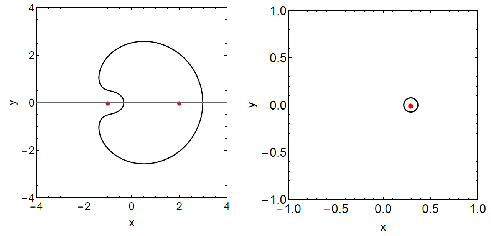

Jupiter's moons provide valuable sources of information that can be applied to exomoons around exoplanets. For example, Io and Europa are in a 2:1 resonance, meaning Europa's orbital period is twice that of Io (3.50 days vs 1.75 days), and Io is significantly tidally heated. Motivated by this interesting configuration, we studied how two exomoons in resonance would be tidally heated. Without being in resonance, an exomoon is likely to be in a circular orbit due to tides, and there would be no tidal heating. Thus, between two moons, we focus on the inner one whose orbit is constantly being perturbed by the outer moon. By converting physical parameters like semi-major axis and eccentricity into canonical coordinates x and y, we map this perturbation, or libration, as a simple curve. The plots below are examples. The left plot is for arbitrary values and the moon experiences significant libration: there is a large curve around the red dots, or fixed points, where there would be minimum perturbation. The plot on the right is for Jupiter-Io-Europa and the small circle around the fixed point makes it clear that this system experiences far less libration. In other words, it's close to perfect resonance.

To track this perturbation and resulting tidal heating, we used the N-body numerical integrator code [REBOUND](https://rebound.readthedocs.io/en/latest/) to simulate theoretical systems made up of two exomoons in resonance around an exoplanet. The inner moon starts off on a circular orbit, with zero tidal heating, but simulations show that the eccentricity is quickly pumped up, leading to an overall significantly heated moon. The plots to the right show results for moons in 2-4 day orbits and 4-8 day orbits around Earth-like and Neptune-like planets. The moon in a two day orbit around an Earth-sized planet experiences the most heating: up to 481 K!

The fact that exomoons can be heated to such high temperatures has strong implications for detection. We describe two indirect methods of finding such a heated moon. The first is the method of secondary eclipses. If we observe a planet as it moves in front of a star and blocks some of its starlight, we would notice a dip in the flux received by instruments here on Earth. However, the planet can reflect starlight, or produce some light of its own, so when it moves behind the star there is another, albeit smaller, dip in the light that reaches us. Hover over the image below to see an animation of how this works. If a hot moon is orbiting the planet as it moves behind the star, there would be a bigger dip than expected from the planet alone. This effect may be observable with future instrumentation.
<!---
 
--->

The second method of detecting exomoons is closely tied to volcanism on the moon. Like Io, a heated moon will expel certain particles like sodium or potassium creating a cloud of material around itself and/or its host planet. Spectroscopy of light that travels through this cloud will reveal sodium/potassium features, elements that are not generally found on gas giant planets, signaling that an exomoon may be there. A [proof of concept](https://iopscience.iop.org/article/10.3847/1538-4357/ab40cc#apjab40ccs3) of this method has already been demonstrated for the Jupiter-Io system.

For more details about exomoons in resonance, tidal heating, and these detection methods, check out our [recently submitted paper](https://arxiv.org/abs/2206.11368).
